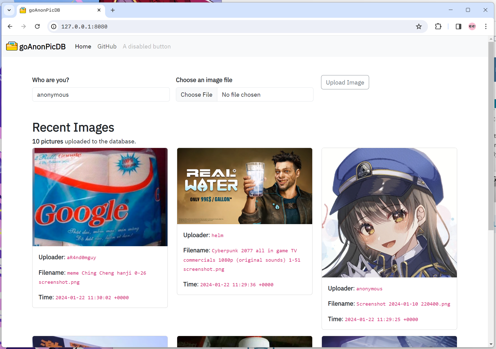
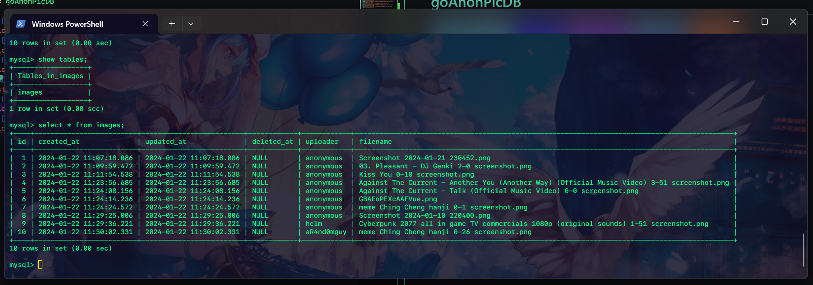

# goAnonPicDB


**goAnonPicDB** is a simple web service that allows users to anonymously upload images. It is built with Go and uses `GORM` as the **ORM (Object-Relational Mapping)** library. The images are stored in a MySQL database. It might be a good example for learning how to organize applications with `docker` and `docker-compose`.

## **Preview**
<br>**User interface (web)**

<br>**Database managing uploaded pictures via filepath (real image data are uploaded to `/static`)**


## Feature

* Anonymous image uploading via HTTP communication
* Display of the 6 most recent images (number may be adjusted by user. Go to `main.go`)
* Count of total uploaded images
* Docker support for easy deployment (via `docker-compose.yaml`)

## Usage

1. **Clone** the repository:

    ```bash
    git clone https://github.com/KnightChaser/goAnonPicDB.git
    cd goAnonPicDB
    ```

2. (optional) Modify `.env` for preconfigured environmental variables (will be applied to `docker-compose.yaml`).

    ```yaml
    MYSQL_ROOT_PASSWORD=root        # (not used in this service actually)
    MYSQL_DATABASE_NAME=images      # The name of database where image filepath is stored
    MYSQL_USERNAME=knightchaser     # The username of database (actually used)
    MYSQL_PASSWORD=goanonpicdb      # The password of database (actually used)
    ```

3. Build and run the Docker containers:

    ```bash
    docker-compose up -d
    ```

4. Access the application at [http://localhost:8080](http://localhost:8080) in your web browser. And you'll see the web implementation of `goAnonPicDB`!


## To-Do
- [x] Dockerize applications
- [x] Create `.env` file and manage cross-service environmental variables and constants (Or do the same thing with other methods)

## Contributing

Contributions are welcome! Please feel free to submit issues or pull requests.